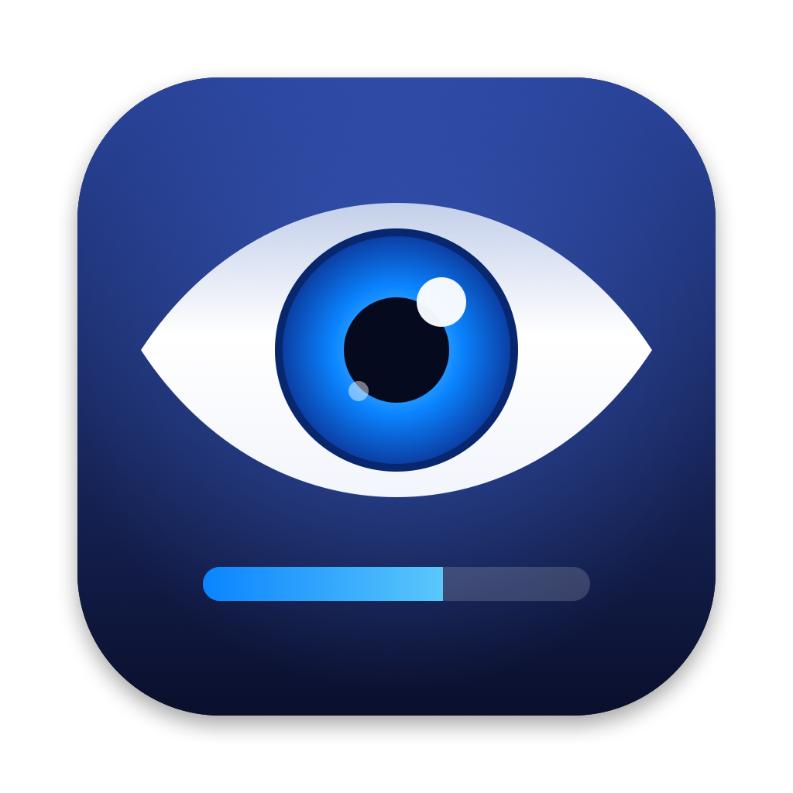

# AwakeTray



Make your Mac not fall asleep.

AwakeTray is a small menu bar eye. While the eye is open, your Mac stays awake: for a time you
choose, or until you tell it to stop.

- **Click** the eye to choose how long to stay awake and whether the display stays on too.
- **Double-click** the eye to start or stop right away.

| Icon | Meaning |
| --- | --- |
| Closed eye | Off, the Mac can sleep |
| Open eye with a blue bar | Keeping awake for a set time; the bar shows the time left |
| Eye with veins | Keeping awake until you stop it |


## Install

1. Download `AwakeTray-<version>.zip` from the
   [Releases](https://github.com/lyuksovannyy/AwakeTray/releases) page and unzip it.
2. Move `AwakeTray.app` to your Applications folder and open it.
3. The app is not notarized, so macOS blocks it the first time. Go to
   System Settings > Privacy & Security and choose **Open Anyway**.

Requires macOS 13 or later. Works on Apple silicon and Intel Macs.

If the eye does not show up, your menu bar is probably full and the icon is hidden behind the
notch; see [Troubleshooting](docs/troubleshooting.md).

## Build from source

```sh
Scripts/build-app.sh
open build/AwakeTray.app
```

Needs Xcode or the Command Line Tools.

## Documentation

- [Using AwakeTray](docs/usage.md): the icon states, clicks and settings
- [Troubleshooting](docs/troubleshooting.md): missing icon, Gatekeeper warning, Mac still sleeping
- [Development](docs/development.md): project layout, how it works, icons, releasing

## License

[MIT](LICENSE)
