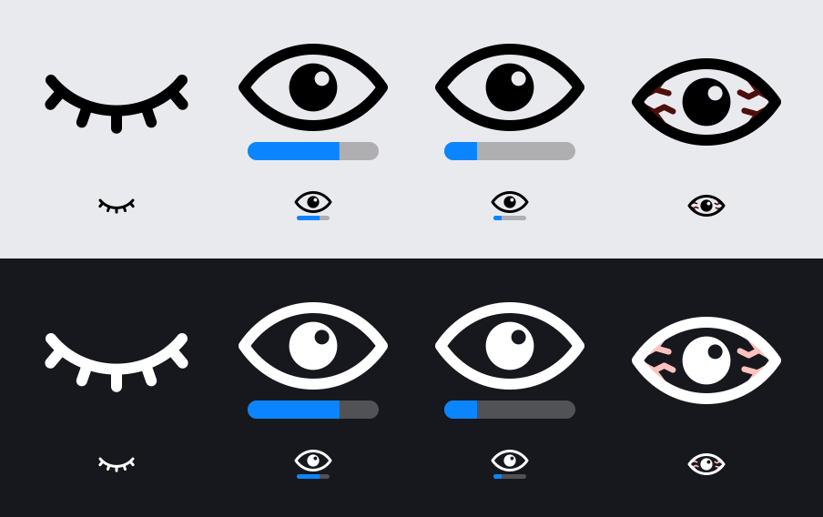

# Using AwakeTray

AwakeTray lives in the menu bar as an eye. It has no Dock icon and no main window.

## The eye

| Icon | State |
| --- | --- |
| Closed eye | Off. The Mac sleeps as usual. |
| Open eye with a blue bar | Keeping awake for a set time. The bar shrinks as the time runs out. |
| Eye with veins | Keeping awake with no time limit, until you stop it. |

## Clicks

- **Click** the eye to open the settings.
- **Double-click** the eye to start with the saved settings, or to stop if it is already running.

A single click waits a quarter of a second before the settings open, so a double-click does not
flash them on screen.

## Settings

- **Stop after a set time**: off by default, which means AwakeTray runs until you stop it.
  Turn it on to pick a duration.
- **Hours and minutes**: any duration from 1 minute to 24 hours. The buttons underneath are
  shortcuts for 15 and 30 minutes and 1, 2, 4 and 8 hours.
- **Keep the display on too**: on by default. Turn it off to let the screen sleep while the Mac
  itself stays awake (useful for downloads or long-running jobs).
- **Keep Awake / Stop**: the same as double-clicking the eye.
- **Quit**: closes AwakeTray and lets the Mac sleep again.

Settings are remembered between launches. Changing them while AwakeTray is running applies them
straight away and restarts the countdown.

When a timed session ends, AwakeTray switches itself off and the eye closes.

## Good to know

- AwakeTray blocks *idle* sleep only. Closing the lid, choosing Sleep from the Apple menu, or a
  critically low battery still put the Mac to sleep.
- AwakeTray does not start by itself at login. To make it, add it under
  System Settings > General > Login Items.
- To check that it is working, run `pmset -g assertions` in Terminal while the eye is open and
  look for "AwakeTray is keeping this Mac awake".

Something not working? See [Troubleshooting](troubleshooting.md).
